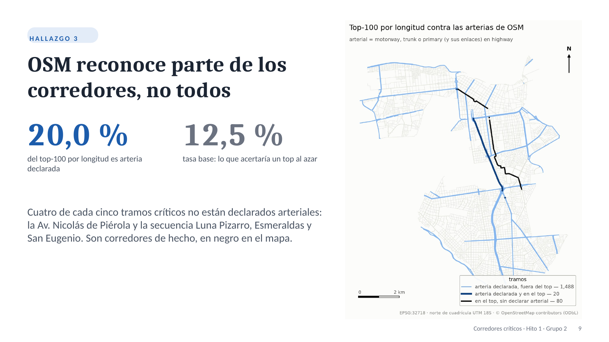

<a id="inicio"></a>

<div align="center">

<h1>InWatch</h1>

<p>
  <strong>Riesgo delictivo latente en Lima, medido bajo el sesgo de denuncia</strong>,<br>
  en experimentos visuales donde cada cifra tiene procedencia verificable.
</p>

<p>
  
  
  
  
</p>

<p>
  <a href="#experimentos">Experimentos</a> ·
  <a href="#tp">TP de Complex Networks</a> ·
  <a href="https://r0sewt.github.io/InWatch/hito1/">Diapositivas del Hito 1</a> ·
  <a href="#empezar">Empezar</a> ·
  <a href="#cifras">Ninguna cifra a mano</a>
</p>

</div>

<p align="center">
  
  <br><sub>La pieza de difusión de <code>pulso-estadios</code>: el riesgo alrededor del Monumental en días de partido, contra el mismo lugar sin partido.</sub>
</p>

<details>
  <summary>Contenido</summary>
  <ol>
    <li><a href="#que-es">Qué es</a></li>
    <li><a href="#experimentos">Experimentos</a></li>
    <li><a href="#tp">TP de Complex Networks: corredores críticos</a></li>
    <li><a href="#como-esta-hecho">Cómo está hecho</a></li>
    <li><a href="#empezar">Empezar</a></li>
    <li><a href="#mapa">Mapa del repo</a></li>
    <li><a href="#convenciones">Convenciones</a></li>
    <li><a href="#equipo">Equipo</a></li>
    <li><a href="#licencia">Licencia</a></li>
  </ol>
</details>

<a id="que-es"></a>

## Qué es

Los datos policiales no miden crimen. Miden la intersección de tres filtros: que la víctima
denuncie, que la institución registre y que el sistema geocodifique. Los tres son fuertes y
desiguales en el espacio, así que un mapa que los ignora muestra dónde se denuncia, no dónde
ocurre.

InWatch es el banco de experimentos donde esa premisa se vuelve manipulable. Cada experimento
es un notebook reactivo que permite mover un parámetro y ver qué le pasa al hallazgo. Dos
reglas atraviesan todo el repo:

- **Sin datos ≠ seguro.** Una celda sin registro se dibuja *deshilachada*, nunca vacía ni
  verde.
- **Ningún número se escribe a mano.** Toda cifra portante sale de un registro canónico,
  con el commit y el hash del script que la produjo (ver [cómo](#cifras)).

No es un producto de ruteo ni un mapa de calor de denuncias.

<p align="right">(<a href="#inicio">volver arriba</a>)</p>

<a id="experimentos"></a>

## Experimentos

Cada uno responde una pregunta, y la respuesta corta está acá. El detalle, los controles y
las limitaciones están en el README de cada experimento.

| Experimento | La pregunta | Lo que encontró |
|---|---|---|
| [`donde-falla-el-dato`](experiments/donde-falla-el-dato/) | ¿Dónde deja de decir algo el mapa de denuncias? | Solo el 34.5 % de la grilla de Lima y Callao tiene al menos un registro geocodificado. <!-- CANON: cobertura.celdas_con_registro = 34.5 --> El resto no es calma: es ausencia de dato. |
| [`observado-latente`](experiments/observado-latente/) | Corregir por subdenuncia, ¿reordena el mapa? | No: ρ = 0.997 entre las dos superficies. <!-- CANON: rango_espacial.spearman = 0.997 --> Cambia la escala y la composición: la estafa pasa de 4.3 % a 32.1 % del riesgo. <!-- CANON: superficie_share_observado.estafa = 4.3 --> <!-- CANON: superficie_share_latente.estafa = 32.1 --> |
| [`curva-de-evaluabilidad`](experiments/curva-de-evaluabilidad/) | Con un registro flaco, ¿se puede saber si el modelo acierta? | Con 10 % de geocodificación, la habilidad real apenas cae (0.433 de ρ), pero la medible se desploma a 0.316. <!-- CANON: evaluabilidad.rho_real_r10 = 0.433 --> <!-- CANON: evaluabilidad.rho_medible_r10 = 0.316 --> Colapsa el termómetro, no el modelo. |
| [`tejido-vs-hexagono`](experiments/tejido-vs-hexagono/) | ¿Cuánto cuesta mirar Lima a través de hexágonos? | El 11.0 % de las manzanas morfológicas cae partido entre dos o más hexágonos: el 27.2 % del área. <!-- CANON: correspondencia.celdas_partidas = 11.0 --> <!-- CANON: correspondencia.area_partida = 27.2 --> |
| [`pulso-estadios`](experiments/pulso-estadios/) | Si el crimen sube alrededor del estadio, ¿hay más delito o más gente que denuncia? | En los primeros 500 m, el riesgo en días de partido es 3.67 veces el de días emparejados sin partido, <!-- CANON: pulso.rr_puerta = 3.67 --> y el pulso desaparece en los partidos sin público. |
| [`corredores-criticos`](experiments/corredores-criticos/) | ¿Qué calles concentran el flujo potencial de la red vial? | Del top-100 por betweenness, solo el 20.0 % es arteria declarada en OSM, contra una tasa base de 12.5 %. <!-- CANON: corredores.pct.precision_top100_length = 20.0 --> <!-- CANON: corredores.pct.arterial_declarada_tramos = 12.5 --> Cuatro de cada cinco corredores no están declarados arteriales. |

<p align="right">(<a href="#inicio">volver arriba</a>)</p>

<a id="tp"></a>

## TP de Complex Networks: corredores críticos

<p align="center">
  <a href="https://r0sewt.github.io/InWatch/hito1/#9">
    
  </a>
  <br><sub>Clic para ver la exposición completa, con el guion de cada diapositiva.</sub>
</p>

`corredores-criticos` es el Trabajo Parcial del curso *Complex Networks* (UPC 1ACC0202,
2026-2), tema 2. Mide la betweenness exacta, por longitud y por tiempo de viaje, sobre la red
`drive` de OpenStreetMap del eje Metropolitano centro-sur: 7559 intersecciones.
<!-- CANON: corredores.conteo.nodos = 7559 -->

| Entregable | Dónde |
|---|---|
| Diapositivas y guion | [r0sewt.github.io/InWatch/hito1](https://r0sewt.github.io/InWatch/hito1/), con PDF y PowerPoint para descargar |
| Notebook con salidas | [`entrega/hito1.ipynb`](experiments/corredores-criticos/entrega/hito1.ipynb), que se abre en GitHub sin correr nada |
| Reporte técnico | [README del experimento](experiments/corredores-criticos/README.md), con cada cifra anclada al registro |
| Entorno | [`requirements.txt`](requirements.txt), generado desde `uv.lock` |

La cadena completa se reprodujo desde un clon limpio en otra máquina: mismos nodos, mismas
aristas y mismas cifras.

<p align="right">(<a href="#inicio">volver arriba</a>)</p>

<a id="como-esta-hecho"></a>

## Cómo está hecho

```
fuentes por nombre ──► loader.py / etapas ──► data/silver/<slug>/*.parquet   (gitignored)
(registry/fuentes.toml)        │                        │
                               ▼                        ▼
                  registry/canonical_numbers.json   notebook.py (marimo) ──► .ipynb / WASM
                  valor + commit + sha del script         │
                  y de los insumos                        ▼
                               └──────────► README y docs citan la cifra por clave
                                            la CI falla si una cita no coincide
```

**Qué corre dónde.** marimo exporta a WASM, pero geopandas y PyTorch Geometric no corren en
Pyodide. Por eso la separación no se negocia: `loader.py` hace el cómputo pesado y deja
parquet con hash; `notebook.py` lee artefactos y presenta, nunca calcula desde datos crudos.

<a id="cifras"></a>

**Ninguna cifra a mano.** El mecanismo existe porque el fallo ya ocurrió: en el repo de
origen, un multiplicador quedó desactualizado tras volver a correr el pipeline y llegó así a
un paper enviado. Ahora el emisor registra el número con su procedencia, y todo lo demás lo
pide por clave:

```python
from inwatch import canon

canon.emit(
    "multiplier.robo_hurto_callejero", lat / obs, variant="victim",
    unit="latente/observado (adim.)", estimator="pooled Σλ*/Σy 2018-2024",
    inputs=[rate_file], script=__file__,
)

canon.display("multiplier.robo_hurto_callejero")   # "4.6", ya redondeado por la policy
```

Los documentos lo citan con un ancla `CANON:` en un comentario HTML junto a la cifra, incluido este README.
`uv run canon check` las valida todas y corre en la CI.

**La unidad espacial es un parámetro.** Conviven la grilla H3 res-8 (`h3_8`), la manzana
censal (`manzana`) y la tesselación morfológica (`morfologica`); poder cambiar entre ellas
*es* uno de los experimentos. El contrato completo está en
[`design/contrato-unidades.md`](design/contrato-unidades.md).

<p align="right">(<a href="#inicio">volver arriba</a>)</p>

<a id="empezar"></a>

## Empezar

**Requisitos:** Python 3.12 (fijado en `.python-version`) y [uv](https://docs.astral.sh/uv/).
uv baja el 3.12 solo si el sistema no lo trae. La cadena se validó en 3.12; 3.13 y 3.14
caben en `requires-python`, pero no están verificados. Sin uv hace falta un `python3.12`
propio (Fedora 43 trae 3.14: `sudo dnf install python3.12`), y luego
`python3.12 -m venv .venv && . .venv/bin/activate && pip install -r requirements.txt`.

**1. Entorno y verificación.** No necesita datos:

```bash
uv sync --extra geo --extra viz
uv run pytest -q -m "not needs_data"
uv run canon check
```

Los tests tienen que pasar, y `canon check` tiene que terminar con
`✓ check_canon: N ancla(s) verificada(s) contra el registro.`

**2. Un experimento de punta a punta.** `corredores-criticos` es el único que corre sin los
datos privados del repo de origen; solo pide `transit_stations.csv` (ver su README):

```bash
export INWATCH_FUENTE_TRANSIT_STATIONS=/ruta/a/transit_stations.csv
for etapa in loader centralidad capas arterias metricas; do
  uv run python experiments/corredores-criticos/$etapa.py
done
uv run marimo edit experiments/corredores-criticos/notebook.py
```

El loader tiene que reportar 7559 nodos y 15813 aristas. La betweenness exacta (`centralidad.py`)
tarda entre 10 y 30 minutos según la máquina: 11 min en gorgo y 30,6 min en una laptop
Fedora de 8 núcleos (medido en 2026-09).
<!-- CANON: corredores.conteo.aristas = 15813 -->

Los demás experimentos leen el corpus de denuncias y los artefactos de la tesis de origen,
que no son públicos. Sus fuentes se resuelven por nombre con `uv run fuentes estado`.

<p align="right">(<a href="#inicio">volver arriba</a>)</p>

<a id="mapa"></a>

## Mapa del repo

| Ruta | Qué hay |
|------|---------|
| `experiments/<slug>/` | Un experimento: etapas de cómputo, `notebook.py`, `README.md` con las cifras ancladas, y tests. |
| `src/inwatch/` | El paquete: `canon` (registro de cifras), `fuentes` (catálogo de datos por nombre) y `unidades` (contrato espacial, incluida la red vial). |
| `registry/` | `canonical_numbers.json`, versionado porque es memoria científica, y `fuentes.toml`. |
| `design/` | Contratos de datos y decisiones de diseño. |
| `analysis/` | Reportes por experimento, versionados; los datos no. |
| `tests/` | Pruebas sobre datos sintéticos, que corren en cada PR. |
| `data/` | Artefactos regenerables (gitignored), salvo `data/curado/`, que sí viaja. |

<p align="right">(<a href="#inicio">volver arriba</a>)</p>

<a id="convenciones"></a>

## Convenciones

- **Git Flow**: nada entra directo a `develop` ni a `main`. Una rama por unidad de trabajo
  (`feat/…`, `fix/…`, `docs/…`) desde `develop`, y un PR con la CI en verde y las
  conversaciones de revisión resueltas. `main` recibe a `develop` por release, con tag por
  entregable (`hito1`, …).
- **Ninguna cifra a mano**: toda cifra portante pasa por `canon`. Lo que emite cifras se
  fusiona con *merge commit*, nunca con squash, para que el commit de procedencia siga
  existiendo en la historia.
- **Tareas en beads** (`bd ready`), no en TODOs sueltos.
- **Repo público**: nada de secretos, credenciales, datos crudos ni rutas de máquina. El
  grupo del TP se nombra por usuario de GitHub.

Las reglas completas, para agentes y para personas, están en [`CLAUDE.md`](CLAUDE.md).

<p align="right">(<a href="#inicio">volver arriba</a>)</p>

<a id="equipo"></a>

## Equipo

<div align="center">
<table>
  <tr>
    <td align="center" width="190">
      <a href="https://github.com/R0SEWT">
        <br>
        <b>Rody Vilchez</b><br><sub>@R0SEWT · autor</sub>
      </a>
    </td>
    <td align="center" width="190">
      <a href="https://github.com/YairJeri">
        <br>
        <b>@YairJeri</b><br><sub>TP de Complex Networks</sub>
      </a>
    </td>
  </tr>
</table>
</div>

<p align="center"><sub>El TP de Complex Networks es del grupo 2 (UPC, 2026-2).</sub></p>

<p align="right">(<a href="#inicio">volver arriba</a>)</p>

<a id="licencia"></a>

## Licencia

**Sin definir todavía, y por eso sin `LICENSE`: todos los derechos reservados.**

El repo es público desde el 2026-09-14 para poder compartirlo, entre otros con el docente
del curso donde se usa. Que sea público no concede permisos de reutilización. La licencia
sigue siendo una decisión pendiente y deliberada: el material derivado proviene de un repo
bajo CC BY-NC-SA 4.0 con dos titulares de copyright, así que no puede elegirse en solitario
ni por defecto. Mientras tanto aplican los términos de GitHub para ver y hacer fork;
cualquier otro uso requiere permiso de los titulares.

<p align="right">(<a href="#inicio">volver arriba</a>)</p>
