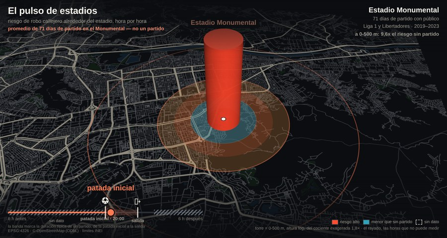

# pulso-estadios — el pulso de crimen alrededor de un partido

## La pregunta

Un partido mete decenas de miles de personas en un punto de la ciudad durante unas pocas
horas. Si el crimen denunciado sube alrededor del estadio ese día, compiten dos
explicaciones: **hay más delito** o **hay más gente que denuncia**.

El diseño las separa sin necesidad de estimar el sesgo. La misma celda es su propio
control —el mismo estadio, el mismo día de semana, el mismo mes, sin partido— y el sesgo
de denuncia es aproximadamente estático por celda, así que se cancela en el contraste
intra-celda. Es identificación más limpia que cualquier análisis de niveles.

Este hito es la **réplica euclidiana**: mide con anillos de distancia al punto del
estadio, igual que el repo de origen. Sirve de baseline para el hito 2, donde la unidad
espacial se vuelve el control y la pregunta pasa a ser si el pulso sobrevive a recortar
el espacio de otra forma.

## Qué se manipula

- **El offset horario** no es un control: es el dominio. El eje X va de −12 h a +12 h
  respecto del kickoff, en bins de una hora.
- **El anillo** — `r0_500`, `r500_1000`, `r1000_2000`, `r2000_4000`.
- **La variante de evento** — multitud (`full`) contra dosis cero (`none`). La segunda
  es la falsificación incorporada: partidos sin público. Si el pulso apareciera también
  ahí, no sería la multitud lo que lo produce.
- **La escala a latente** — el exceso dividido por r̂ distrital de robo. Va declarado
  como **escalado, no como estimación fina**: r̂ es distrital y estático, y el supuesto
  que lo hace admisible es justo el mismo que el diseño intra-celda explota.

## Qué encontró

En la puerta —los primeros 500 m, en la ventana de kickoff ± 4 h— el rate-ratio contra
días emparejados sin partido es de:

<!-- CANON: pulso.rr_puerta = 3.67 -->

sobre <!-- CANON: pulso.dias_tratados = 201 --> días tratados con kickoff conocido, no
contaminados por un estadio vecino y con al menos un control emparejado.

El efecto decae rápido con la distancia y desaparece en el anillo exterior, que actúa
como área de control. La variante dosis cero da un rate-ratio **por debajo de 1** en la
puerta: el pulso no aparece cuando no hay multitud, que es exactamente lo que el diseño
predice si lo que lo produce es la gente y no el hecho de que haya partido.

## La réplica, y por qué resultó ser lo más importante del hito

El criterio de cierre no era que la curva se viera bien: era reproducir
`stadium_hourly.json` del repo de origen. Desviación relativa máxima obtenida sobre las
16 celdas del contraste:

<!-- CANON: pulso.desviacion_replica = 0.0000 -->

Es decir, réplica exacta. Pero llegar ahí destapó dos cosas que valen más que el número.

**El script que produjo el ancla ya no corre.** `infelix/scripts/eval_stadium_hourly.py`
importa `CROSS_CONTAM_M`, `RING_EDGES`, `RING_NAMES` y `day_table` de
`eval_stadium_event_study`, que define `RINGS`/`RING_LABELS` y ninguno de esos cuatro
nombres; y calcula `pd.to_datetime(date) − EPOCH` restando un timestamp naive a uno
tz-aware. Está roto por dos lados independientes. Verificado por AST, sin ejecutar nada:
el repo de origen es read-only. Registrado en el bead `inwatch-b3w`.

**Pero el ancla estaba superada, y eso cambia la lectura.** `stadium_hourly.json` es del
9-jul 16:05; el mismo día a las 20:20, `stadium_event_study.json` lo reemplazó con un
bloque `hour_window_full` bajo otra ventana —`[kickoff−4h, kickoff+5h]` en vez de
`kickoff±4h`— y **ésas** son las cifras que cita el reporte publicado. Su productor
corre. Así que esta réplica no es el único chequeo ejecutable sobre cifras publicadas,
como decía una versión anterior de este párrafo: ninguna cifra publicada depende del
artefacto que se replicó. Lo que la réplica prueba —y sigue valiendo— es que el port
reproduce la maquinaria exactamente. El análisis completo está en
`analysis/pulso-estadios.md`.

**Los insumos crecieron después de computarse el ancla.** `stadium_hourly.json` tiene
fecha del 9-jul-2026 16:05; el commit `766ad9d`, de las 20:11 del mismo día, añadió 94
filas a `stadium_matchdays.csv` —copas, selección y 26 conciertos— que el ancla nunca
vio. Con los fixtures de hoy la réplica **no puede** cuadrar, y eso no habría sido deriva
del port. Por eso el loader corre dos épocas: valida contra los fixtures congelados en el
commit del ancla (exportados a `data/bronze/` vía `git show`, que es lectura pura) y
reporta con los vivos.

Este experimento es, entonces, una demostración del fallo que motivó el registro canónico
de este repo: un número que sobrevive al cambio de su pipeline y de sus insumos. Sólo que
aquí se puede señalar con el dedo.

## Qué se heredó sin re-litigar

Decisiones del repo de origen que se replican tal cual, porque re-abrirlas rompería la
comparabilidad con el ancla:

- Horas fraccionales en `America/Lima` e índice absoluto `día×24+h`, para cruzar
  medianoche sin artefactos.
- Estrato = día tratado. Controles = días sin evento del mismo estadio × año-mes ×
  día-de-semana, contados en la misma ventana de reloj.
- Se excluyen los `00:00:00` exactos —default de hora desconocida— y las modalidades
  aorísticas (vehículo, autopartes, casa habitada), donde la hora registrada es la del
  descubrimiento y no la del hecho (Ratcliffe 2002).
- MH rate-ratio estratificado con un tratado por estrato; bootstrap sobre días tratados,
  B = 2000, semilla 42.
- **El orden del anti-centroide.** El umbral de pile-up por coordenada se calcula sobre
  las cinco categorías y el recorte a robo callejero viene después. No es un detalle: lo
  que detecta es una comisaría geocodificando todo a su puerta, y una comisaría no
  discrimina por categoría. Filtrar antes deja entrar centroides que el original
  descarta, y ése fue el único origen del 12% de desviación inicial.

Tres piezas hubo que **reconstruirlas**, porque desaparecieron del módulo de origen. Van
marcadas en `loader.py` como `SUPUESTO DEL PORT` con su evidencia:

1. Los bordes de anillo, leídos de las claves del propio JSON de ancla. Ojo: **no** son
   los `RING_EDGES` de `eval_stadium_power.py`, que son otra rejilla.
2. El umbral de contaminación cruzada entre estadios. Sin fuente directa; calibrado
   contra el ancla, que lo acota entre 1.200 m (la distancia nacional–matute, que el
   original declara contaminada) y 9.642 m. Hay un test que lo fija.
3. El calendario diario por estadio, reconstruido de su uso.

Y una rareza que se replica **a propósito**: el original etiqueta toda la tabla de
matchdays como `liga1`, de modo que los conciertos que viven en ese CSV entran al
contraste como si fueran fútbol mientras que los de `stadium_extra_events.csv` quedan
fuera. Probablemente no era la intención, pero reproducirlo es la única forma de cuadrar.

## Procedencia

Tres hilos de titularidad distintos, y conviene que estén escritos:

| Insumo | Origen | Nota |
|---|---|---|
| `LIMA.parquet` (denuncias SIDPOL) | encargo freelance El Comercio / proyecto Wachi | Tercer titular, además del repo de origen |
| `stadium_matchdays.csv`, `stadium_extra_events.csv` | infelix | CC BY-NC-SA 4.0, dos titulares |
| `h3_feature_matrix.parquet` | infelix | idem |
| `stadium_hourly.json` | infelix | **Ancla de réplica, no insumo** |

Nada se copia al repo de origen: se lee y se exporta a `data/` de éste. `data/` está
gitignored, así que ningún insumo ni artefacto intermedio entra al repo, que es público
desde el 2026-09-14. Lo que sí queda a la vista es el código y las cifras agregadas del
registro canónico, que derivan de estas fuentes: por eso la licencia de InWatch sigue
**sin definir** y el repo va sin `LICENSE` (todos los derechos reservados).

## Cómo correrlo

```bash
uv sync --extra geo --extra viz
uv run python experiments/pulso-estadios/loader.py     # ~4 min, 179 MB de fuente
uv run marimo edit experiments/pulso-estadios/notebook.py
```

El loader cachea los puntos limpios en `data/bronze/pulso-estadios/`; borrarlo fuerza el
reprocesado completo.

## La pieza de difusión

`pieza/` contiene el video que recorre las trece horas en los tres estadios sobre un mapa
nocturno en 3D. No estima nada: lee el parquet del perfil por estadio y lo dibuja. Vive
acá y no fuera del repo porque el video citaba cifras en pantalla sin forma de
re-derivarlas, y porque sus rutas de OSM estaban escritas a mano contra una laptop.



El código y el póster se versionan; el basemap horneado, los frames y el mp4 son
regenerables y van a `data/pieza/`. Los siete pasos para regenerarlo, cómo se lee la
codificación y qué hay que saber antes de tocarla están en
[`pieza/README.md`](pieza/README.md).

## Hito 2 · el corte alternativo (`inwatch-8ke`)

El propio repo de origen escribió que *la multitud no llega en círculos, llega por el
Metropolitano y la Línea 1*, y aun así midió con buffers euclidianos. El hito 2 recorta
el espacio de otras tres formas y deja que el notebook las superponga en una sola escala
(log2 del rate-ratio, que no depende del área de la banda):

| Unidad | Qué es «cerca» | Cortes |
|---|---|---|
| `anillo` | línea recta al punto del estadio (la réplica del hito 1) | 0-500-1000-2000-4000 m |
| `banda_red` | distancia caminando sobre la red peatonal de OSM | los mismos, en metros de red |
| `banda_red_area` | la misma distancia de red | igualados por área al disco euclidiano |
| `morfologica` | saltos de celda en celda sobre el tejido de E5 | igualados por área de tejido |

**Mismos metros no es mismo tamaño.** La distancia de red es siempre mayor o igual que
la euclidiana, así que la banda de red de 0-500 m es un recorte más chico que el disco.
`banda_red_area` existe para separar la forma del tamaño; la tesselación, que se mide en
saltos, sólo admite esa versión.

**El criterio de «sobrevive» se fijó antes de calcular**, en el notebook, y se commiteó
antes de la primera corrida. Métrica primaria: el contraste de `pulso.rr_puerta`
calculado en cada unidad; sobrevive si su IC bajo supera 1, la dosis cero no lo supera y
hay gradiente; se *mueve* si el bootstrap pareado contra el anillo excluye la razón 1.
El perfil horario es secundario y descriptivo: un bin es medible sólo si cumple **a la
vez** las dos nociones de soporte que hoy conviven (`inwatch-ap1`): `PISO_CONTROL` de la
pieza y el mínimo de estratos del notebook.

Los resultados viven en el notebook y en los parquet `*_unidades`. **Ninguna cifra de
este hito es portante todavía**: `loader_unidades.py` no llama a `canon.emit`. Se emite
cuando se adjudique el soporte (`inwatch-ap1`) y se decida qué unidad es canónica.

### Por qué es `loader_unidades.py` y no `loader.py`

`loader.py` es el emisor de las tres cifras de arriba y el registro guarda su sha256:
tocarlo las deja stale, y el hook de pre-commit lo bloquea con razón. El hito 2 importa
al loader del hito 1 sin modificarlo y copia sólo la preparación, que allá vive inline
dentro de `construir`. Dos cosas lo mantienen honesto: un test que verifica que las
líneas copiadas siguen siendo las del loader, y una verificación en cada corrida de que
el anillo recalculado reproduce `pulso.rr_puerta` del registro.

### Decisiones de este hito

- **Una sola foto de OSM.** La red peatonal sale del extracto Geofabrik
  (`osm_peru_gpkg`, capa `gis_osm_roads_free`), el mismo del que E5 construyó el tejido,
  y no de una descarga osmnx: el contrato de unidades prohíbe mezclar fotos dentro de un
  experimento. La topología es la de OSM —dos vías se conectan sólo donde comparten un
  vértice—, así que un puente peatonal no se une a la vía que cruza. No se caminan
  `motorway`, `motorway_link`, `busway` (el carril del Metropolitano) ni `cycleway`.
- **El origen de la distancia de red** es el mismo punto del anillo, con acceso en línea
  recta a todo nodo a menos de 300 m, que cubre el perímetro de los tres recintos.
- **La adyacencia morfológica cruza calles.** `touched_to` de E5 sólo une celdas de la
  misma manzana; con sólo eso, un anillo de adyacencia nunca sale de la manzana del
  estadio. Se añade la contigüidad entre manzanas, y cruzar la calle cuenta un salto.
- **Lo que no tiene unidad se pierde y se cuenta.** Un punto a más de 150 m de toda
  vereda, o fuera del tejido, queda sin banda en esa unidad: no se reasigna a la más
  cercana. `masa_unidades.parquet` dice cuántos, por estadio. El tejido de E5 cubre mal
  los alrededores del Monumental, y ahí la pérdida es grande.
- **La correspondencia** anillo ↔ cada unidad se mide sobre una rejilla de píxeles de
  25 m (`correspondencia_unidades.parquet`), con los dos factores de área del contrato y
  el test de masa: cada banda de origen suma 1 contando la fila «fuera».

```bash
uv run --extra geo python experiments/pulso-estadios/loader_unidades.py   # ~1 min
```

Necesita el tejido de E5 en `data/silver/tejido-vs-hexagono/` (lo produce
`experiments/tejido-vs-hexagono/loader.py`).

## Qué falta

- La distancia se mide desde el estadio, no desde las estaciones: el hito 2 recorta por
  la red que la gente **camina**, no por la que la **trae**. Una banda centrada en las
  estaciones del Metropolitano y la Línea 1 es la pregunta siguiente.
- La emisión al registro de las cifras del hito 2, tras `inwatch-ap1`.
- El perfil por estadio de la pieza (`perfil_estadio_movil.parquet`) lo produce hoy un
  script fuera del repo (`inwatch-cw7`); el hito 2 no lo usa ni lo reemplaza.
